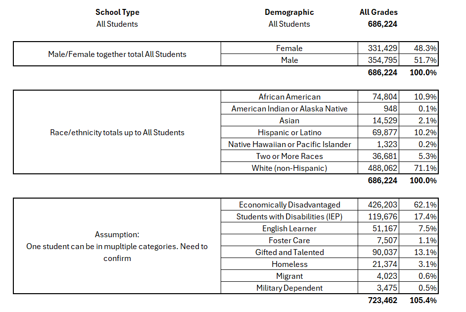

# Kentucky School System                       
                       
## Project Goal
Investigate Kentucky public school education data to explore the relationship between student enrollment, chronic absenteeism, and dropout rate.

The datasets will be cleaned, transformed, stored to SQL and queried, and visualized using Python.

### Datasets Used: 
- Kentucky Student Enrollment
- Kentucky Chronic Absenteeism 
- Kentucky Drop Out Rate
- Kentucky County for state regions

The school datasets are mostly clean with several commonalities between the datasets, as they are all from the same source.   
Each school dataset includes:
School Year, County Number, County Name, District Number, District Name, School Number, School Name, School Code, State School Id, NCES ID, CO-OP, CO-OP Code, School Type, and Demographic

After these headers, is where the data varies depending on what I'm looking at. Enrollmenet data has additional columns for enrollment, Absenteeism for Absenteeism and Dropout rate for Dropout rate.

## Key Findings across all three school datasets:
School year represents the start of fall through end of spring

County Name only has one county number, but each county can have more than one District number in it.

The district numbers are not limited to one school

School Number can represent more than one school

Each school has several lines and these are broken up into grade, with subgroups by demographic. 

Each School has a unique school ID
Regardless of the grade, they all have PS though 14th grade (Maybe older students coming back?..Need to research this one..)
-    For the grades not listed, there are *. I believe these would represent NaNs
-    Per education.ky.gov:
-       Grade 14 “may only be selected for Special Education students participating in Alternate
        Assessment, as determined by the student’s Admissions and Release Committee (ARC)
        and documented on their Individual Education Program (IEP).” 
        each School has a unique school ID

NCES stands for the National Center for Education Statistics. It is the main federal group that gathers, studies, and shares data about education in schools and colleges.

Other:
    School Numbers are not unique to school name or even county (like school ID 105). Sometimes they are and sometimes they are not (like school ID 164 and 590).

### Demographics
Demographics has 18 categories: All Students, male/female, ethnicity, and other classification categories

#### Observations
- Sex categories total 100%
- Race/Ethnicity totals 100%
- Special Population Categories are above 100%

## Key Findings for both Chronic Absenteeism and Dropout Rates:
Both datasets have suppressed columns with Yes or No values and values in the absenteeism total and dropout rate percent that are represented by an asterisk (*). These values are intentionally Suppressed per mandate by the government to protect the identity of students.

## Student Enrollment
Beyond the key findings above, this is where the enrollment data lives. There are "All Grades" per school with columns for Preschool through Grade 14 (with Grade 13 excluded)

#### Candidate Keys To Be Validated:
- School Year
- School Code
- Demographic

## Absenteeism
Outside of the main columns listed above, there are four column listed:
-    Suppressed
-    Chronically Absent Students
-    Students Enrolled 10 or More Days
-    Chronic Absenteeism Rate

#### Candidate Keys To Be Validated:
- School Year
- School Code
- Grade
- Demographic

## Drop Out Rate
Outside of the main columns listed above, there are two column listed:
-    Suppressed
-    Dropout Rate

#### Candidate Keys To Be Validated:
- School Year
- School Code
- Demographic

## Citation:
2023-2024 & 2024-2025:
- https://reportcard.kyschools.us/data-download?pid=c340f7d5-efbd-5fb8-cab8-3a128835f84c

KY flag color scheme used for charts:
- https://www.flagcolorcodes.com/kentucky

National Center for Education Statistics:
- https://nces.ed.gov/

Grade 14:
- https://www.education.ky.gov/specialed/excep/GuidanceResources/Documents/Questions_%20and_Answers_Related_to_Grade_14_Students.pdf

Data Suppression:
- https://www.education.ky.gov/school/csip/Documents/Suppressed%20Data%20Guidance.pdf
- https://www.education.ky.gov/AA/distsupp/Documents/Understanding_Kentucky_Minimum_N_School_Accountability.pdf